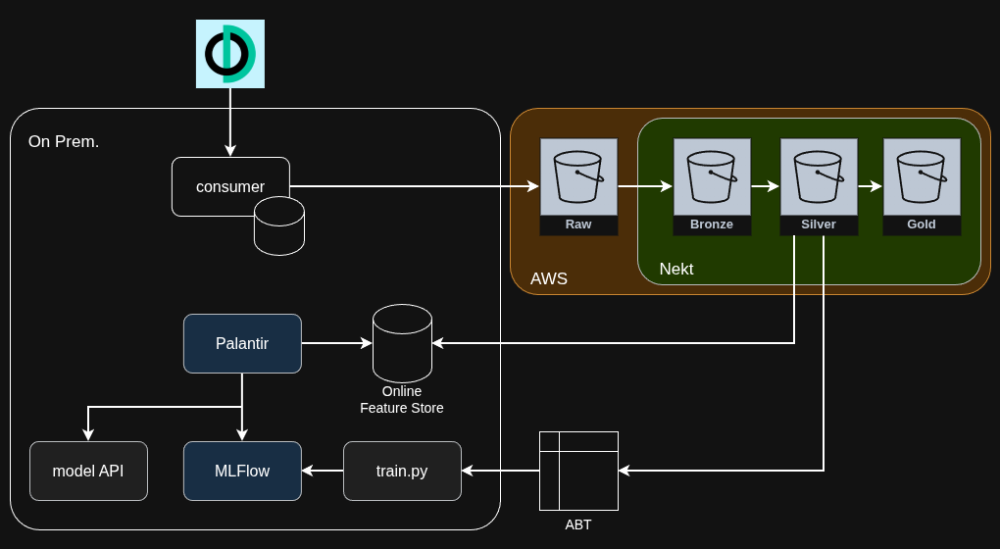

# League of Legends Data pipeline

Projeto de coleta, armazenamento, processamento e analise de dados de League of Legends utilizando a Riot Games API como fonte principal.

Este repositório documenta a arquitetura proposta para construir um pipeline de dados orientado a partidas, com foco em:

- coleta automatizada de dados de partidas, jogadores e campeonatos;
- armazenamento operacional em SGDB-SQL para metadados e consultas rapidas;
- persistencia de dados detalhados em um bucket S3 na AWS;
- leitura posterior desses dados pela Nekt como ambiente analítico;
- desenvolvimento de analises exploratorias, feature store e modelos de machine learning;

O objetivo final e transformar dados brutos do ecossistema competitivo e público de League of Legends em uma base confiavel para exploracao analitica e modelos preditivos.

## Objetivos

- Construir uma base histórica de partidas profissionais de League of Legends com confiabilidade;
- Permitir ingestao incremental e reprocessamento controlado;
- Estruturar uma camada simples de metadados em SQL;
- Persistir dados ricos de cada partida em S3 para leitura pela Nekt;
- Criar datasets analiticos para exploracao, BI e ML;
- Evoluir para predição de resultados, desempenho em campeonatos e dinamica de rotacao de jogadores;

## Casos de Uso

O ecossistema de dados deste projeto pode suportar, entre outros, os seguintes casos:

- análise de win rate por jogador, campeão, equipe, patch, etc;
- avaliação de desempenho por jogador e equipe;
- monitoramento de tendencias por campeonato;
- estudo de drafts e combinações de campeões;
- predição do vencedor de uma partida antes do início;
- predição do desempenho de uma equipe em um torneio;
- identificacao de mudancas de roster com maior impacto competitivo;
- construcao de indicadores de sinergia entre jogadores;

## Roadmap Sugerido

As fases abaixo organizam a evolucao do projeto e servem como indice para as secoes seguintes:

| Fase | Objetivo | Principais frentes |
| --- | --- | --- |
| 1. Fundacao | estabelecer a base operacional do projeto e a primeira coleta confiavel | configurar projeto Python; criar cliente da Riot API; definir schema SQLite; criar rotina de coleta incremental |
| 2. Data Lake | separar armazenamento operacional de armazenamento detalhado e permitir reprocessamento | persistir payload bruto no S3; padronizar paths e particionamento; adicionar transformacao para dados bronze |
| 3. Analitica | transformar dados coletados em ativos analiticos reutilizaveis | produzir datasets para exploracao; integrar leitura pela Nekt; criar indicadores de performance |
| 4. ML | evoluir da analise descritiva para predição e apoio a decisao | construir pipeline de features; treinar baseline de predição de partidas; evoluir para modelos de campeonato e rotacao |

## Trilha de Machine Learning

O projeto pode evoluir em camadas de maturidade.

| Fase | Objetivo |
| --- | --- |
| predição de resultado de partida | prever vitoria ou derrota antes do início da partida ou a partir do draft |
| predição de desempenho em campeonatos | estimar classificacao, avancos em brackets ou expectativa de vitorias |
| Análise de rotacao de jogadores | entender impacto de entrada e saida de jogadores em uma equipe |

## Limitacoes e Cuidados

- a Riot API pode ter limites de taxa e cobertura variavel conforme o endpoint;
- nem toda partida possui o mesmo nivel de detalhamento disponivel;
- dados competitivos mudam rápido com patches e alteracoes de roster;
- modelos podem degradar com o tempo e exigem retreino recorrente;
